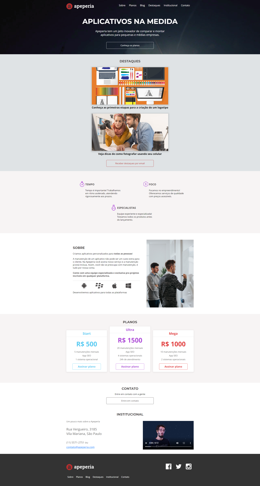

# Projeto Apeperia

## Visão Geral

#

### Projeto de um Site Web que oferece serviços de desenvolvimento de aplicativos mobile para empresas de pequeno e médio porte.

#

⏳ Projeto realizado em 3 dias.
#
## Construido com:
- HTML
- CSS

## Funcionalidades:
- Oferta de pacotes de serviços.
- Fornece informações sobre a empresa e seus produtos. 

## O que eu aprendi:
- HTML semântico
- CSS
  - Responsividade para telas mobile
  - Conceito de mobile First
    - Desenvolver o projeto a partir do layout mobile
  - Uso de variáveis no CSS
    - Uma boa pratica para reaproveitamento de código
  - Uso das unidades de medida 'em' e 'rem' na estilização da página

## Link

Veja o projeto aqui: [Acessar🌎](https://devhiderlan.github.io/projeto-apeperia/)

## Autor

Hiderlan Santana: [Linkedin](https://www.linkedin.com/in/hiderlan-santana/)